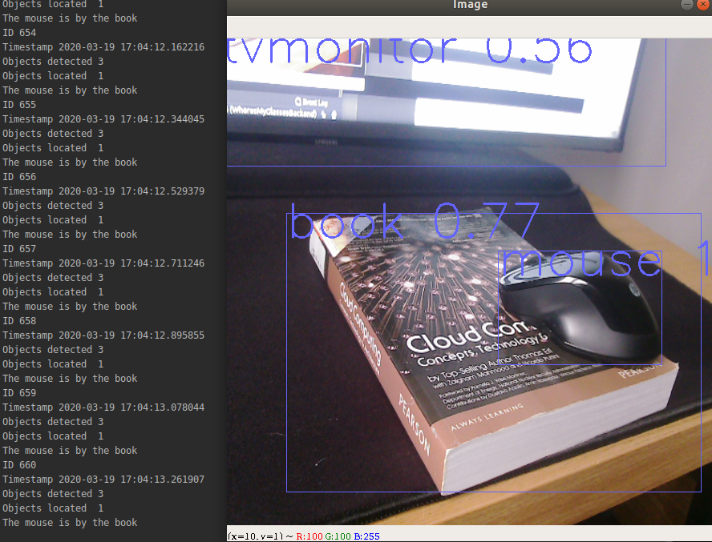

# Wheres My Glasses (Backend)
Object location system with MQTT connection using Intel RealSense, Darknet and YOLO object detection. 

  

Combine with the associated 
[frontend code](https://github.com/d3-worgan/WheresMyGlassesFrontend) to build a voice activated object location assistant. There 
is also [associated code](https://github.com/d3-worgan/darknet-docker) 
for downloading open images dataset and training object detection models using docker containers.

[pjreddie](https://github.com/pjreddie/darknet) and [AlexyAB](https://github.com/AlexeyAB/darknet) for 
YOLO and Darknet.


## Installation (Linux)
### 1. Install the RealSense SDK
Follow the instructions on the [RealSense](https://github.com/IntelRealSense/librealsense/blob/master/doc/distribution_linux.md) 
github to install the RealSense SDK.

### 2. Build and install Darknet & YOLO
If we want to use a GPU to improve object detection speed we need to build Darknet from source. 
Skip this step if using a CPU and use the ```--opencv``` option to use the opencv CPU implementation of darknet. 
Follow the [instructions](https://github.com/AlexeyAB/darknet#how-to-compile-on-linux-using-make) to build darknet. The easiest way 
is using ```make```. Note the dependencies in the darknet repo like CUDA 10.0, CUDNN 7.0. Other versions may cause issue.

1. Change into a directory and download the darknet code e.g.
```
cd ~
mkdir wmg
cd wmg
git clone https://github.com/AlexeyAB/darknet.git
cd darknet
```
2. Set the GPU option in the Makefile to 1, also set the LIBSO option to 1 to build for linux. You can also configure 
darknet to use CUDNN if it is installed.
```
sed -i "s/GPU=0/GPU=1/" Makefile
sed -i 's/LIBSO=0/LIBSO=1/' Makefile
sed -i 's/CUDNN=0/CUDNN=1/' Makefile
```
3. Build darknet
```
make
```
4. The result of this should be a ```libdarknet.so``` file in the ```darknet/``` directory.

### 3. Setup the project
Now that RealSense and Darknet are ready we can prepare the WheresMyGlasses project.
1. Change out of the darknet directory and download WheresMyGlasses e.g.
```
cd ../
git clone https://github.com/d3-worgan/WheresMyGlassesBackend.git
cd WheresMyGlassesBackend
```
2. Create a conda python environment
```
conda create -y -n wmg python=3.6 
conda activate wmg
```
3. Install the python dependencies
```
pip install -r requirements.txt
```
4. Copy the darknet library file we made earlier into the WheresMyGlasses project e.g.
```
cp ../darknet/libdarknet.so modules/object_detection
```
5. Download the WheresMyGlasses [weights file](https://drive.google.com/file/d/1HCr2iXLc3uIMUm8qxLNP_1Lpp0qFj__9/view?usp=sharing) and save it into ```modules/object_detection/models/wmg/```
6. Test the installation
```
python main.py --display
```
This should show a video stream and the bounding box detections.

## Usage
If we wanted to use the CPU version 
```
python main.py --display --opencv
```
We could specify an alternative detection model (see below to install an [alternative model](https://github.com/d3-worgan/WheresMyGlassesBackend#alternative-detection-models))
```
python main.py --display --model yolov3
```
To connect the system to MQTT we need to specify the ```--mqtt``` flag.
```
python main.py --display --mqtt
```
The MQTT broker address defaults to localhost or the IP address of the machine. 
To specify the address of the MQTT broker use the ```--broker``` flag e.g.
```
python main.py --display --yolov3 --mqtt --broker 192.168.0.123
```

To test the mqtt is working, open a separate terminal window and make sure mosquitto mqtt client is installed
```
sudo apt install mosquitto-clients
```
Then publish the name of the object we want to search for on mqtt topic ```"frontend/request"``` e.g.
```
mosquitto_pub -h 127.0.1.1 -t frontend/request -m "glasses"
```
In the backend terminal window we should see some output with the locater searching for the object
and producing a final json message which it will publish on the "backend/response" topic e.g.

```
{"code_name": "1", "original_request": "glasses", "location_time": "2020-10-17 16:17:15.511648", "minutes_passed": "1.18", "locations_identified": ["{\"object\": \"Glasses\", \"location\": \"Human head\", \"camera_id\": \"831612071526\"}"]}
```


## Alternative detection models
There are several [pre-trained models](https://github.com/AlexeyAB/darknet#pre-trained-models) available on the AlexyAB 
repository. Or we can use a custom trained model. To keep model management simple, each model should be saved into its own folder with its corresponding ```.weights```, ```.cfg```, ```.names``` and ```.data``` files inside the 
```modules/object_detection/models/``` folder. Here is an example.
1. Change into the models directory
```
cd modules/object_detection/models/
```
2. Make a new directory for the detection model
```
mkdir yolov3
cd yolov3
```
3. Download the model files
```
cp ../../../../../darknet/cfg/yolov3.cfg yolov3.cfg
cp ../../../../../darknet/cfg/coco.names coco.names
cp ../../../../../darknet/cfg/coco.data coco.data
wget https://pjreddie.com/media/files/yolov3.weights
```
4. Point the path in the ```.data``` file to the ```.names``` file
```
sed -i 's/names = data\/coco.names/names = modules\/object_detection\/models\/yolov3\/coco.names/' coco.data
```
4. Then the model name can be specified on the command line using the ```--model``` option e.g. ```--model yolov3``` 
(see the example usage). 


